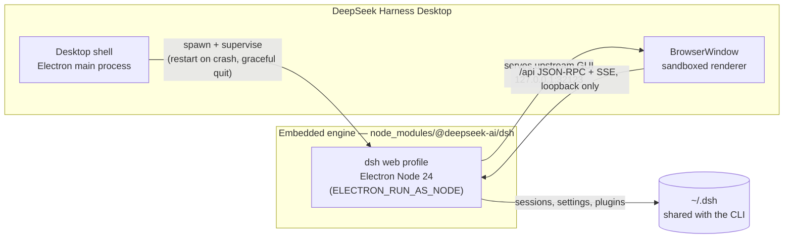
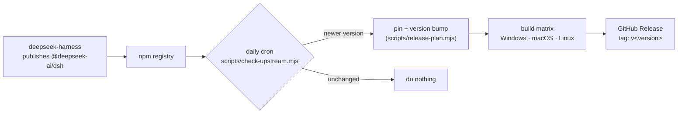

# DeepSeek Harness Desktop

[](https://github.com/a1647517212/deepseek-harness-desktop/actions/workflows/ci.yml)
[](https://github.com/a1647517212/deepseek-harness-desktop/releases)
[](LICENSE)

**DeepSeek Harness Desktop** is the desktop client of [DeepSeek Harness](https://github.com/deepseek-ai/deepseek-harness): no terminal, no Node.js installation, no `dsh web` command. Double-click the icon and the full DeepSeek Harness web GUI opens in its own window.

**DeepSeek Harness Desktop** 是 [DeepSeek Harness](https://github.com/deepseek-ai/deepseek-harness) 的桌面客户端：不需要终端、不需要安装 Node.js、也不需要 `dsh web` 命令。双击图标，完整的 DeepSeek Harness 网页版界面就会在自己的窗口里打开。

> 完整中文版见 [README.md](README.md)。

## Why this project exists

DeepSeek Harness ships an excellent browser GUI, but reaching it is a developer workflow: install Node.js, install the CLI from npm, run `dsh web`, then open `http://127.0.0.1:3080` in a browser. That is three steps too many for people who want an application, not a server: non-developers, users who just want to chat with an agent in a window, and anyone who wants the same experience as VS Code or Claude Desktop — install, double-click, work.

DeepSeek Harness Desktop removes those steps without forking anything. It is a thin, ~500-line shell around the published [`@deepseek-ai/dsh`](https://www.npmjs.com/package/@deepseek-ai/dsh) npm package: it boots the exact same `web` profile the CLI boots, opens a native window on it, and keeps the engine supervised. When the upstream project releases, this repository rebuilds installers automatically through GitHub Actions — see [Automatic releases](#automatic-releases-when-upstream-updates).

## How it works — self-hosting with deepseek-harness

The desktop app **does not reimplement the harness**. It is bootstrapped by deepseek-harness itself, at two levels:

**Runtime self-hosting.** The app bundles the published `@deepseek-ai/dsh` package (a fully self-contained distribution: the CLI entry, all `@deepseek-ai/*` plugins, and the built web frontend). At startup the desktop shell spawns `dsh web` as a child process using Electron's own Node.js 24 runtime (`ELECTRON_RUN_AS_NODE=1`) — no system Node is needed — and waits for it to serve on loopback. The window then loads the upstream GUI from `http://127.0.0.1:<port>`. Every feature, plugin, preset, and session of the harness is present because the harness itself is running. There is zero forked UI code. One Electron-specific detail: the web profile's hot-reload row needs Node's internal ESM loader, which under plain Node comes from the `node-addon-require-builtin` fallback — an addon Electron's Node build does not load — so the desktop shell starts the engine with Node's own `--expose-internals` flag instead.

**Development self-hosting.** This repository — its Electron shell, release automation, and bilingual documentation — was written by a coding agent running *inside* DeepSeek Harness. The initial version was produced end-to-end in a single agent session: 34 minutes 41 seconds of build time, a 99% context-cache hit rate, and ¥1.45 (≈ US$0.21) in model cost. The desktop client is a product of the harness it wraps.



## Advantages

- **Double-click to start.** No terminal, no Node.js, no browser tab to manage. The engine starts with the window and shuts down with it — there is never an orphan server left behind.
- **Always the real harness.** The GUI is the upstream web GUI served by the embedded engine, so desktop users get every upstream feature as soon as a new build is released — no separate UI to maintain or drift out of sync.
- **Shares state with the CLI.** The app uses the standard `~/.dsh` data directory by default, so sessions, settings, and plugins created in `dsh` on the command line appear in the desktop client and vice versa. Set `DSH_HOME` to isolate if you prefer.
- **Zero-install engine.** Electron 43 bundles Node.js 24, which satisfies the harness's own engine requirement; users never install a runtime.
- **Multi-platform.** Windows (NSIS installer), macOS (DMG, Apple Silicon and Intel), and Linux (AppImage + deb) are built from one codebase.
- **Automatic releases.** A scheduled GitHub Actions job watches the npm registry; when upstream publishes a new `@deepseek-ai/dsh`, this repository pins the new version, builds all three platforms, and publishes a GitHub Release — no human in the loop.
- **Small and reviewable.** The desktop layer is a handful of modules (spawn, readiness poll, window, quit lifecycle); everything interesting lives upstream.
- **Loopback-only by design.** The engine binds `127.0.0.1` only, and the renderer runs with `contextIsolation` and `sandbox` enabled — the desktop adds no new attack surface beyond what the harness itself exposes.

## Getting started

Download the latest installer for your platform from [Releases](https://github.com/a1647517212/deepseek-harness-desktop/releases):

| Platform | Artifact | Notes |
| --- | --- | --- |
| Windows 10/11 (x64) | `*-Setup.exe` | NSIS installer. Unsigned builds trigger a SmartScreen prompt: click *More info → Run anyway* (see [Known limitations](#known-limitations)). |
| macOS (Apple Silicon) | `*-arm64.dmg` | Unsigned: right-click the app and choose *Open* the first time. |
| macOS (Intel) | `*-x64.dmg` | Same as above. |
| Linux (x64) | `*-x86_64.AppImage` or `*.deb` | `chmod +x` the AppImage first, or install the deb. |

After installation, launch **DeepSeek Harness Desktop** like any other application. The first start takes a few seconds while the engine initializes its profile under `~/.dsh`.

### Run from source (developers)

Requires Node.js ≥ 22.12:

```sh
git clone https://github.com/a1647517212/deepseek-harness-desktop.git
cd deepseek-harness-desktop
npm install
npm start          # run the app (Electron + embedded engine)
```

Useful scripts:

| Command | What it does |
| --- | --- |
| `npm start` | Launch the desktop app in development. |
| `npm run smoke` | Boot the embedded engine headlessly (no Electron, isolated temp `DSH_HOME`), fetch the served page, shut it down — the core CI gate. |
| `npm run dist` / `dist:win` / `dist:mac` / `dist:linux` | Package installers with electron-builder. |
| `npm run check:upstream` | Compare the pinned engine version against the npm registry. |

**Restricted networks.** The Electron binary and the packaging tools download from GitHub; if that is blocked on your network, point them at a mirror before installing or packaging:

```sh
# PowerShell
$env:ELECTRON_MIRROR="https://npmmirror.com/mirrors/electron/"
$env:ELECTRON_BUILDER_BINARIES_MIRROR="https://npmmirror.com/mirrors/electron-builder-binaries/"

# bash
export ELECTRON_MIRROR=https://npmmirror.com/mirrors/electron/
export ELECTRON_BUILDER_BINARIES_MIRROR=https://npmmirror.com/mirrors/electron-builder-binaries/
```

A root `postinstall` guard (`scripts/ensure-electron.mjs`) makes a silently-failed binary download loud and actionable instead of leaving a tree that installs but cannot launch.

## Automatic releases when upstream updates

The desktop app's engine pin (`dependencies["@deepseek-ai/dsh"]` in `package.json`) is the single source of truth. The [release workflow](.github/workflows/release.yml) keeps installers in lockstep with upstream without any change to the upstream repository:



**Triggers**

| Trigger | Behavior |
| --- | --- |
| `schedule` (daily) | Checks the npm registry; only builds when a newer `@deepseek-ai/dsh` exists. |
| `workflow_dispatch` | Manual build. Optional `upstream` input forces a specific engine version; without it, the current pin is rebuilt with an incremented desktop patch. |
| push of `v*` tag | Builds and releases that exact version (hotfixes and bootstrap; legacy `desktop-v*` remains supported). |
| `repository_dispatch: upstream-published` | Optional fast path: if the upstream repo (or your fork of it) ever sends this event on publish, the build starts immediately instead of waiting for the next cron run. |

**Versioning.** Desktop versions mirror the embedded engine: upstream `0.1.0-rc.6` → desktop `0.1.0-rc.6.0`; a desktop-only rebuild increments the last segment (`…rc.6.1`). Release tags use the semver-compatible form `v<version>` so `electron-updater` can discover releases in the personal repository; legacy `desktop-v<version>` tags still trigger builds.

**Optional upstream hook.** To publish desktop builds the moment upstream releases (instead of within 24 h via cron), add this step to the upstream repository's release workflow:

```yaml
- name: Notify desktop client
  run: |
    curl -X POST \
      -H "Authorization: token ${{ secrets.DESKTOP_REPO_PAT }}" \
      -H "Accept: application/vnd.github.everest-preview+json" \
      https://api.github.com/repos/a1647517212/deepseek-harness-desktop/dispatches \
      -d '{"event_type": "upstream-published"}'
```

A fine-grained PAT with *contents: write* on this repository is sufficient. Nothing here is required — the daily cron makes the pipeline fully automatic on its own.

## Configuration

| Variable | Default | Meaning |
| --- | --- | --- |
| `DSH_HOME` | `~/.dsh` (shared with the CLI) | Harness data directory: sessions, settings, plugins. Passed through to the embedded engine. |
| `DSH_DESKTOP_PORT` | `32123,32124,32125` (first free wins) | Comma-separated preferred loopback ports for the embedded engine. |

## Project layout

```
src/main/          Electron main process: engine supervision, window, menu, quit lifecycle
src/preload/       Sandboxed context bridge (desktop.getInfo / restartHarness / quit)
src/renderer/      Local loading and error pages (the GUI itself is served by the engine)
scripts/           check-upstream, release-plan, bump-version, smoke-dsh-web
.github/workflows/ ci.yml (engine smoke) and release.yml (auto-build + GitHub Release)
build/             Icons and build resources for electron-builder
```

## Security

- The engine binds loopback only (`127.0.0.1`); it is never reachable from the network.
- The window runs with `contextIsolation: true`, `sandbox: true`, and `nodeIntegration: false`; the preload exposes exactly three operations (info, restart, quit).
- External links open in the system browser; the window itself never navigates off the loopback origin.
- `npmRebuild` is disabled in packaging so native modules keep their Node ABI — the engine runs under plain Node, not Electron's ABI.

## Known limitations

- **Unsigned installers.** macOS Gatekeeper and Windows SmartScreen will warn because binaries are not code-signed (certificates cost money and identities). Standard workarounds: *Open* via right-click on macOS, *More info → Run anyway* on Windows. Code signing is the first item on the roadmap.
- **No in-app auto-update yet.** New versions are published as GitHub Releases; the app does not self-update. (`electron-updater` is planned once signing exists.)
- **Single window.** One window per app instance; a second launch focuses the existing window instead of starting a second engine.
- The embedded engine inherits upstream's own requirements (e.g. a shell such as PowerShell or bash is expected on the host for shell-based tools).

## Roadmap

- Code signing + notarization, then `electron-updater` for in-app updates.
- System tray mode (keep the engine running with the window closed).
- Linux arm64 and Windows arm64 artifacts.

## License

MIT — see [LICENSE](LICENSE).

Upstream project: [deepseek-ai/deepseek-harness](https://github.com/deepseek-ai/deepseek-harness) (MIT). This repository embeds the published npm package `@deepseek-ai/dsh` without modification.
