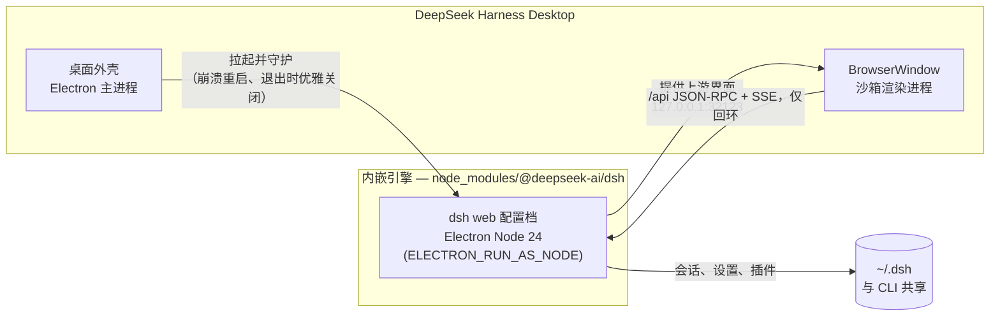
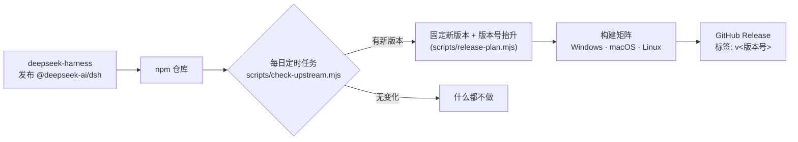

# DeepSeek Harness Desktop

[](https://github.com/a1647517212/deepseek-harness-desktop/actions/workflows/ci.yml)
[](https://github.com/a1647517212/deepseek-harness-desktop/releases)
[](LICENSE)

**DeepSeek Harness Desktop** 是 [DeepSeek Harness](https://github.com/deepseek-ai/deepseek-harness) 的桌面客户端：不需要终端、不需要安装 Node.js、也不需要 `dsh web` 命令。双击图标，完整的 DeepSeek Harness 网页版界面就会在自己的窗口里打开。

**DeepSeek Harness Desktop** is the desktop client of [DeepSeek Harness](https://github.com/deepseek-ai/deepseek-harness): no terminal, no Node.js installation, no `dsh web` command. Double-click the icon and the full DeepSeek Harness web GUI opens in its own window.

> 完整英文版见 [README.en.md](README.en.md)。

## 为什么要做这个项目

DeepSeek Harness 自带一个非常完善的浏览器界面，但使用它的路径是纯开发者式的：安装 Node.js → 从 npm 安装 CLI → 运行 `dsh web` → 再打开浏览器访问 `http://127.0.0.1:3080`。对于只想“装个应用、双击就用”的人来说——非开发者、只想在窗口里和智能体对话的用户，以及期望获得 VS Code、Claude Desktop 式体验的人——这三步都太繁琐了。

DeepSeek Harness Desktop 在不复制任何上游代码的前提下消除了这些步骤。它是发布在 npm 上的 [`@deepseek-ai/dsh`](https://www.npmjs.com/package/@deepseek-ai/dsh) 包外面的一层约 500 行的“壳”：启动与 CLI 完全相同的 `web` 配置档，用原生窗口承载它，并全程守护引擎进程。上游项目一发布新版本，本仓库就会通过 GitHub Actions 自动构建出新的安装包——见[上游更新时的自动发版](#上游更新时的自动发版)。

## 工作原理——用 deepseek-harness 自举

桌面客户端**不重新实现任何 harness 功能**，它在两个层面上由 deepseek-harness 自举：

**运行时自举。** 应用打包了 npm 上的 `@deepseek-ai/dsh` 发行包（一个完全自包含的分发：CLI 入口、全部 `@deepseek-ai/*` 插件以及构建好的网页前端）。启动时，桌面外壳用 Electron 自带的 Node.js 24 运行时（`ELECTRON_RUN_AS_NODE=1`）把 `dsh web` 作为子进程拉起——用户无需安装任何 Node——然后等待它在回环地址上提供服务，窗口再加载 `http://127.0.0.1:<端口>` 上的上游界面。harness 的所有功能、插件、预设和会话都原封不动，因为它本身就是那个正在运行的 harness。没有一行复刻的界面代码。有一个 Electron 特有的细节：web 配置档的热重载行需要 Node 的内部 ESM loader，纯 Node 下它由 `node-addon-require-builtin` 这个原生插件兜底提供，而 Electron 的 Node 构建加载不了该插件——所以桌面外壳改用 Node 自带的 `--expose-internals` 参数启动引擎。

**开发过程自举。** 本仓库——Electron 外壳、发版自动化与中英双语文档——是由一个运行在 DeepSeek Harness **内部**的编码智能体写出来的。初始版本的全部产出（代码、工作流、双语文档与验证）在该智能体的一次会话中完成：总用时 34 分 41 秒，上下文缓存命中率 99%，模型调用花费约 1.45 元人民币。这个桌面客户端正是它所包裹的 harness 的产物。



## 优势

- **双击即用。** 不需要终端、Node.js，也不用再管一个浏览器标签页。引擎随窗口启动、随窗口关闭——永远不会留下一个无人管理的后台服务。
- **永远是真 harness。** 界面就是内嵌引擎提供的上游网页界面，桌面用户在新版本发布后立即获得上游的全部新功能——没有需要单独维护、容易脱节的 UI 副本。
- **与 CLI 共享数据。** 应用默认使用标准的 `~/.dsh` 数据目录：命令行 `dsh` 里创建的会话、设置和插件，桌面端直接可见，反之亦然。需要隔离时设置 `DSH_HOME` 即可。
- **零安装的引擎。** Electron 43 内置 Node.js 24，满足 harness 自身的运行时要求；用户永远不需要手动装运行时。
- **多平台。** Windows（NSIS 安装包）、macOS（DMG，Apple Silicon 与 Intel 双架构）、Linux（AppImage + deb）由同一份代码构建。
- **自动发版。** 定时运行的 GitHub Actions 任务盯守 npm 仓库：上游一发布新版 `@deepseek-ai/dsh`，本仓库就固定新版本、构建三大平台并发布 GitHub Release——全程无需人工介入。
- **小而可审查。** 桌面层只有几个模块（拉起、就绪探测、窗口、退出生命周期）；真正的内容都在上游。
- **天然只监听回环。** 引擎只绑定 `127.0.0.1`，渲染进程开启 `contextIsolation` 与 `sandbox`——桌面层没有在 harness 自身之外引入新的攻击面。

## 启动方法

从 [Releases](https://github.com/a1647517212/deepseek-harness-desktop/releases) 下载对应平台的安装包：

| 平台 | 安装包 | 说明 |
| --- | --- | --- |
| Windows 10/11（x64） | `*-Setup.exe` | NSIS 安装程序。未签名版本会触发 SmartScreen 提示：点 *更多信息 → 仍要运行*（见[已知限制](#已知限制)）。 |
| macOS（Apple Silicon） | `*-arm64.dmg` | 未签名：首次打开请右键应用选择 *打开*。 |
| macOS（Intel） | `*-x64.dmg` | 同上。 |
| Linux（x64） | `*-x86_64.AppImage` 或 `*.deb` | AppImage 先 `chmod +x` 再运行，或直接安装 deb。 |

安装后像普通应用一样启动 **DeepSeek Harness Desktop**。首次启动需要几秒钟，引擎会在 `~/.dsh` 下初始化它的配置档。

### 从源码运行（开发者）

需要 Node.js ≥ 22.12：

```sh
git clone https://github.com/a1647517212/deepseek-harness-desktop.git
cd deepseek-harness-desktop
npm install
npm start          # 启动应用（Electron + 内嵌引擎）
```

常用脚本：

| 命令 | 作用 |
| --- | --- |
| `npm start` | 开发模式启动桌面应用。 |
| `npm run smoke` | 无头启动内嵌引擎（不用 Electron，隔离的临时 `DSH_HOME`），访问页面后关闭——CI 的核心门槛。 |
| `npm run dist` / `dist:win` / `dist:mac` / `dist:linux` | 用 electron-builder 打包安装包。 |
| `npm run check:upstream` | 将固定的引擎版本与 npm 仓库对比。 |

**网络受限的环境。** Electron 二进制与打包工具默认从 GitHub 下载；如果你的网络访问不了，安装或打包前改用镜像：

```sh
# PowerShell
$env:ELECTRON_MIRROR="https://npmmirror.com/mirrors/electron/"
$env:ELECTRON_BUILDER_BINARIES_MIRROR="https://npmmirror.com/mirrors/electron-builder-binaries/"

# bash
export ELECTRON_MIRROR=https://npmmirror.com/mirrors/electron/
export ELECTRON_BUILDER_BINARIES_MIRROR=https://npmmirror.com/mirrors/electron-builder-binaries/
```

根目录的 `postinstall` 守护脚本（`scripts/ensure-electron.mjs`）会把被静默吞掉的二进制下载失败变成响亮、可操作的错误，而不是留下一个"安装成功却启动不了"的目录树。

## 上游更新时的自动发版

桌面应用的引擎固定版本（`package.json` 里的 `dependencies["@deepseek-ai/dsh"]`）是唯一的事实来源。[发版工作流](.github/workflows/release.yml)让安装包与上游保持同步，且不需要改动上游仓库任何东西：



**触发方式**

| 触发器 | 行为 |
| --- | --- |
| `schedule`（每天一次） | 检查 npm 仓库；只有存在更新的 `@deepseek-ai/dsh` 时才构建。 |
| `workflow_dispatch` | 手动构建。可选的 `upstream` 输入强制指定引擎版本；不填则把当前固定版本重新构建一次（桌面补丁号 +1）。 |
| 推送 `v*` 标签 | 构建并发布该确切版本（热修复、首次引导用；旧 `desktop-v*` 仍兼容）。 |
| `repository_dispatch: upstream-published` | 可选的快速通道：上游仓库（或你 fork 的上游）在发布时发送这个事件，构建立即开始，不必等下一次定时任务。 |

**版本规则。** 桌面版本号镜像内嵌引擎：上游 `0.1.0-rc.6` → 桌面 `0.1.0-rc.6.0`；仅桌面自身的重建只递增最后一段（`…rc.6.1`）。发布标签为 semver 可解析的 `v<版本号>`，确保 `electron-updater` 能发现个人仓库中的 Release；旧 `desktop-v<版本号>` 标签仍可触发构建。

**可选的上游钩子。** 如果希望上游一发布桌面版就同步构建（而不是等定时任务的最多 24 小时），可以在上游仓库的发版工作流里加这样一步：

```yaml
- name: Notify desktop client
  run: |
    curl -X POST \
      -H "Authorization: token ${{ secrets.DESKTOP_REPO_PAT }}" \
      -H "Accept: application/vnd.github.everest-preview+json" \
      https://api.github.com/repos/a1647517212/deepseek-harness-desktop/dispatches \
      -d '{"event_type": "upstream-published"}'
```

给本仓库授予 *contents: write* 的细粒度 PAT 即可。这一步完全可选——每日定时任务已经让整个流程全自动了。

## 配置

| 变量 | 默认值 | 含义 |
| --- | --- | --- |
| `DSH_HOME` | `~/.dsh`（与 CLI 共享） | harness 数据目录：会话、设置、插件。原样透传给内嵌引擎。 |
| `DSH_DESKTOP_PORT` | `32123,32124,32125`（取第一个空闲端口） | 内嵌引擎的候选回环端口，逗号分隔。 |

## 项目结构

```
src/main/          Electron 主进程：引擎守护、窗口、菜单、退出生命周期
src/preload/       沙箱上下文桥（desktop.getInfo / restartHarness / quit）
src/renderer/      本地加载页与错误页（主界面本身由引擎提供）
scripts/           check-upstream、release-plan、bump-version、smoke-dsh-web
.github/workflows/ ci.yml（引擎冒烟测试）与 release.yml（自动构建 + GitHub Release）
build/             electron-builder 的图标与构建资源
```

## 安全性

- 引擎只监听回环地址（`127.0.0.1`），网络上的任何机器都访问不到它。
- 窗口以 `contextIsolation: true`、`sandbox: true`、`nodeIntegration: false` 运行；preload 只暴露三个操作（获取信息、重启引擎、退出）。
- 外部链接交给系统浏览器打开；窗口本身永远不会离开回环源。
- 打包时关闭 `npmRebuild`，保证原生模块保持 Node ABI——引擎跑在纯 Node 下，而不是 Electron 的 ABI 下。

## 已知限制

- **安装包未签名。** 由于二进制没有代码签名（证书需要费用与身份），macOS Gatekeeper 和 Windows SmartScreen 会提示。常规绕过方式：macOS 右键 *打开*；Windows *更多信息 → 仍要运行*。代码签名是路线图上的第一项。
- **暂不支持应用内自动更新。** 新版本以 GitHub Release 形式发布，应用本身不会自更新。（签名方案落地后计划接入 `electron-updater`。）
- **单窗口。** 一个实例一个窗口；第二次启动只会聚焦已有窗口，而不是再开一个引擎。
- 内嵌引擎继承上游自身的运行要求（例如 shell 类工具需要宿主机上有 PowerShell 或 bash）。

## 路线图

- 代码签名与公证，随后接入 `electron-updater` 实现应用内更新。
- 系统托盘模式（窗口关闭后引擎常驻）。
- Linux arm64 与 Windows arm64 安装包。

## 许可证

MIT — 见 [LICENSE](LICENSE)。

上游项目：[deepseek-ai/deepseek-harness](https://github.com/deepseek-ai/deepseek-harness)（MIT）。本仓库原封不动地内嵌其 npm 发布包 `@deepseek-ai/dsh`。

## 鸣谢

- [LINUX DO](https://linux.do/)
